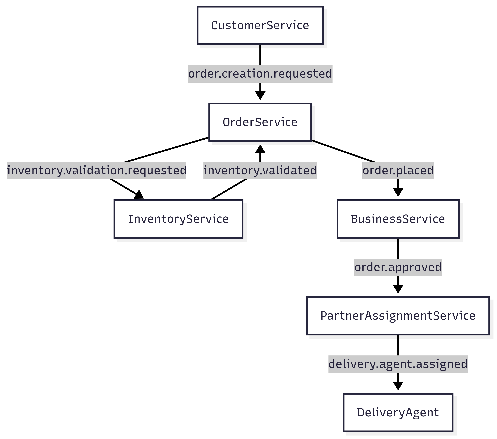

# 🛒 OpenOrderFlow

**OpenOrderFlow** is a distributed, event-driven backend architecture that powers real-time order lifecycle management for commerce platforms — inspired by systems at companies like Swiggy, Uber Eats, and Amazon Fresh.

Built as a fully modular microservices backend, it emphasizes clean boundaries, asynchronous processing, and production-ready design — with extensible support for scale, observability, and team-based ownership.

---

## 🚀 Why OpenOrderFlow?

- ⚙️ **Production-quality microservice boundaries** with domain-driven isolation  
- 📡 **Kafka-based event choreography** to decouple and scale independently  
- 🔐 **JWT + Spring Security** with future support for device/session tracking  
- 📍 **Geo-proximity feed generation** using indexed data & recommendation logic  
- 🧠 **Order placement algorithm** with Redis-powered idempotency + rate limiting  
- 🔁 **Asynchronous lifecycle orchestration** with FSM-aligned event transitions  
- 📦 **Modular Gradle repo** with reusable common libraries  

---

## 🧱 Microservices & Features

### ✅ `customer-service`
- Phone login + OTP verification  
- JWT issuance + security filter setup  
- Address book management  
- Emits: `order.creation.requested`, `customer.address.updated`

### 🏢 `business-service`
- Business + outlet creation  
- Approves orders post-placement  
- Consumes: `order.placed`  
- Emits: `order.approved`, `order.rejected`

### 📦 `inventory-service`
- Item catalog + inventory per outlet  
- Consumes: `inventory.validation.requested`  
- Emits: `inventory.validated`, `inventory.invalidated`

### 🧾 `order-service`
- Receives order requests  
- Calls InventoryService, validates & enriches  
- FSM logic for order lifecycle progression  
- Emits: `inventory.validation.requested`, `order.placed`

### 💸 `payment-service`
- Handles prepaid payments (UPI, Card, Wallets)  
- Can emit `payment.completed` or `payment.failed`  
- Prepares future support for retry/rollback mechanisms

### 🔔 `notification-service`
- Listens to key lifecycle events (order placed, approved, rejected, etc.)  
- Sends mock push/email notifications  
- Built to plug into real channels (Firebase, SMS, email)

### 🛵 `partner-assignment-service`
- Listens to approved orders  
- Assigns delivery partners based on outlet geo, time, and availability  
- Emits: `delivery.agent.assigned`


## DOCS
### [Database Schema Doc 🔗](docs/dbschema.md)
### [Domain Events (Kafka topics and event types) 🔗](docs/events.md)
### [Kafka Event PayloadSchema 🔗](docs/eventpayloads.md)
### [Order Finite State Machine diagram 🔗](docs/Order_FSM.png)
---

## 🧠 System Design Highlights

- 🧩 **Choreographed Saga Pattern** — Each service emits/consumes events to build an FSM-driven, loosely coupled workflow  
- 🔄 **Idempotency Layer via Redis** — Prevents duplicate event processing by setting unique Redis flags tied to event IDs  
- 🚫 **Rate Limiting** — Enforces per-customer ordering limits using Redis counters and time-based expiry  
- 🧭 **Geo-based Business Feed** — `customer-service` provides tailored business feeds using outlet coordinates and customer address  
- 🗺️ **FSM-Aligned Event Contracts** — Order lifecycle modeled as a finite state machine, with Kafka events as state transitions  

---

## ⚙️ Tech Stack

| Layer         | Stack |
|---------------|-------|
| Language      | Java 21 |
| Framework     | Spring Boot 3 |
| Messaging     | Apache Kafka (KRaft mode) |
| DB            | PostgreSQL |
| Cache         | Redis |
| Auth          | JWT + Spring Security |
| Infra         | Docker + Docker Compose |
| Build Tool    | Gradle (multi-module) |
| Mapping       | MapStruct |
| Logging       | Logback + MDC tracing |
| Observability | Kafka UI, (Prometheus/Grafana - planned) |

---

## 🔐 Auth Flow (Spring Security + JWT)

- On OTP verification, customer receives JWT  
- Token is signed + verified using symmetric key (HS256)  
- All protected routes require Authorization header  
- `@CurrentUser` annotation auto-injects authenticated user object in controller methods  
- Future support for device/session tracking for security + rate control  

---

## 📬 Event Flow — Order Lifecycle Example




Events are versioned (e.g. `order.placed.v1`) and managed in a shared contract module (`common-lib`).

---

## 📦 DTO & Event Design

- DTOs and events are decoupled (no reuse of web models in Kafka contracts)  
- Separate packages for:
  - `request`, `response` DTOs  
  - `v1.events` Kafka contracts  
- Avoid Java `record` for mutable structures — all event/DTO models use Lombok + builder  
- Mapped using MapStruct with nested mapping support  

---

## 🧪 Setup & Running Locally

```bash
# Spin up Kafka + Redis + Kafka UI
cd infra
docker compose up -d

# Start all services with maven (any)
```

---

## 📌 TODO / Roadmap

- [ ] Add delivery status lifecycle + FSM  
- [ ] Add data seeding shell for initial test data  
- [ ] Create basic UI with login, browse, place order  
- [ ] Add monitoring (Prometheus + Grafana)  
- [ ] Implement DLQ + retries for Kafka failures  
- [ ] Partner rejection + fallback assignment strategy  
- [ ] Customer loyalty engine (based on past orders)  

---

## ✨ Highlighted System Capabilities

| Capability                          | Status         |
|-------------------------------------|----------------|
| Auth + JWT + Spring Security        | ✅             |
| Order Placement + FSM Design        | ✅             |
| Kafka Event Orchestration           | ✅             |
| Inventory Validation Logic          | ✅             |
| Rate Limit / Idempotency via Redis  | ✅             |
| Business Admin Approvals            | ✅             |
| Partner Assignment Strategy         | ⏳ In Progress |
| Geo-based Feed Generation           | ✅             |
| Notifications on Events             | ✅             |

---

## 🤝 Team + Intent

Built solo, but with the mindset of a **staff engineer** designing for scale, learning, maintainability, and production constraints. The code emphasizes:

- Long-term service boundary clarity  
- Decoupled async coordination  
- Clean layers and contracts  

This project demonstrates backend fluency far beyond boilerplate systems — and showcases **ownership-driven design** and **systemic thinking**.

---

## 📌 Want to explore more?

If you're an engineer, recruiter, or enthusiast curious about:

- Large-scale backend design  
- Kafka event patterns  
- Distributed systems thinking in code  

→ Let's connect on [LinkedIn](https://www.linkedin.com/in/sivaramshabari)

---

## 🪪 License

MIT
